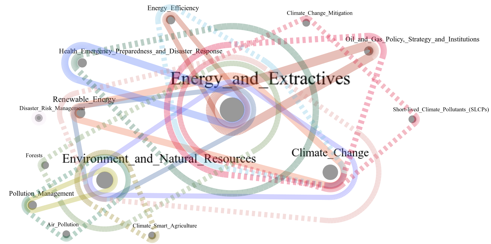

# Frequent itemset mining can measure how global events thematize the media 

## Description
This repository contains supplementary scripts and data associated with the research paper titled "Frequent itemset mining can measure how global events thematize the media " authored by A. Ficsor, T. Cvzetkó, V. Sebestyén, and J. Abonyi. The objective of this project is to extract data from the GDELT database and use frequent itemset mining techniques to identify patterns within news data and use temporal hypergraphs to conduct an in-depth analysis of the derived patterns.

## Result of the Analysis




## Installation
1. Clone the repository:
    ```sh
    git clone https://github.com/Attila772/fpm_hypergraph_news
    ```
2. Make a virtual environment and activate it:
   ```sh
    python -m venv venv
    venv/scripts/activate
    ```
3. Install the required packages:
    ```sh
    pip install -r requirements.txt
    ```
4. Download `spmf.jar` from [SPMF - The Sequential Pattern Mining Framework](https://www.philippe-fournier-viger.com/spmf/index.php?link=download.php) and place it into the working directory.

## Usage

### Step 1: Download Data
1. Set the time frame in `download.py`:
    ```python
    start_time, end_time = get_time_frame('2023-10-30', '2024-01-13')
    ```
2. Run `download.py` after setting the time frame:
    ```sh
    python download.py
    ```

### Step 2: Process Data
1. Set the name of the folder that should contain the processed data in `process.py` (the folder should exist, the code will return an error if it doesn't):
    ```python
    wrangled_folder = "2023"
    ```
2. Run `process.py`:
    ```sh
    python process.py
    ```

### Step 3: Frequent Pattern Mining
1. Ensure `spmf.jar` is in the working directory.
2. Set the folder name in `fpm.py` (should be the same as `wrangled_folder` from before):
    ```python
    folder = "2023"
    ```
3. Configure the SPMF algorithm and arguments:
    ```python
    spmf = Spmf("FPMax", input_filename=f"{folder}/{dir}/{dir}_t.txt", output_filename=f"{folder}/{dir}/patterns.txt", arguments=[0.01])
    ```
4. Run `fpm.py`:
    ```sh
    python fpm.py
    ```

### Analysis
After running `fpm.py` successfully, each folder will contain a `patterns.txt` file with the frequent patterns from the given day. Use `analysis.py` to rename the columns and translate the indices from the SPMF output to their real readable names. It uses the `.csv` saved in `process.py`. `analysis.py` provides an example of how to handle the data and rename the SPMF output indices to a readable format.
